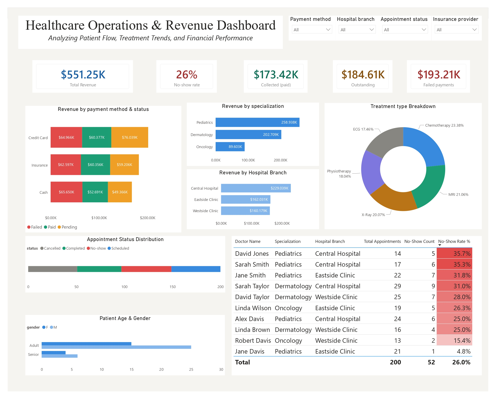

# Hospital Management Data  

### A Data Analyst Portfolio Project

**Tools used:** Excel · MySQL 8.0 · Power BI Desktop  
**Dataset:** 5 tables · 50 patients · 10 doctors · 200 appointments · Jan–Dec 2023  
**Skills demonstrated:** Data cleaning · Relational database design · SQL analytics · DAX · Dashboard design

---

> This project simulates a real-world analytics workflow for a multi-branch clinic.
> Raw CSV files were cleaned in Excel, loaded into a relational MySQL database,
> analyzed using SQL, and visualized in a single-page Power BI dashboard.
> Every number in this report comes directly from the dataset.

---

## 📸 Dashboard Preview



---

## Table of Contents

1. [Project background](#1-project-background)
2. [Dataset overview](#2-dataset-overview)
3. [Part 1 — Excel data cleaning](#3-part-1--excel-data-cleaning)
4. [Part 2 — MySQL database & queries](#4-part-2--mysql-database--queries)
5. [Part 3 — Power BI dashboard](#5-part-3--power-bi-dashboard)
6. [Key findings](#6-key-findings)
7. [Recommendations](#7-recommendations)
8. [How to reproduce this project](#8-how-to-reproduce-this-project)
9. [Repository structure](#9-repository-structure)

---

## 1. Project background

A multi-branch healthcare clinic wanted to understand three things:

- **Revenue health** — how much money is being billed, collected, and lost
- **Operational efficiency** — are patients showing up, and which doctors struggle most with no-shows
- **Treatment & patient mix** — which treatments generate the most revenue and what does the patient base look like

The dataset covers a full calendar year (January–December 2023) across three branches: Central Hospital, Eastside Clinic, and Westside Clinic. The analysis was performed entirely from scratch — raw CSV exports, no pre-cleaned data.

---

## 2. Dataset overview

Five CSV files were provided. Below is a summary of each table and the data quality issues found.

| Table | Rows | Key columns | Issues found |
|---|---|---|---|
| `patients_clean.csv` | 50 | patient_id, gender, date_of_birth, insurance_provider, age_group | Dates stored as text in some rows |
| `doctors.csv` | 10 | doctor_id, specialization, hospital_branch, years_experience | Clean — no issues |
| `appointments.csv` | 200 | appointment_id, patient_id, doctor_id, appointment_date, status | Date column needed explicit type cast |
| `treatments.csv` | 200 | treatment_id, treatment_type, cost | `cost` column: values quoted with commas e.g. `" 3,941.97 "` |
| `billing.csv` | 200 | bill_id, amount, payment_method, payment_status | `amount` column: same quoted comma issue + header had a leading space |

**Data model relationships:**

```
patients (1) ──► (many) appointments (many) ◄── (1) doctors
                        │
                       (1)
                        │
                  treatments (1)
                        │
                       (1)
                        │
                   billing (1)
```

---

## 3. Part 1 — Excel data cleaning

Before importing into MySQL, the following issues were resolved in Excel.

### Issue 1 — Quoted comma values in `billing.csv` and `treatments.csv`

The `amount` and `cost` columns contained values formatted as text with thousands separators inside quotes, for example `" 3,941.97 "`. MySQL cannot import these as numeric values without cleaning.

**Fix applied in Excel (new helper column, then paste-as-values to replace original):**

```excel
=VALUE(TRIM(SUBSTITUTE(E2,",","")))
```

- `SUBSTITUTE(E2,",","")` removes the comma separator
- `TRIM()` removes the leading and trailing spaces
- `VALUE()` converts the resulting text string to a number

The cleaned column was renamed `amount` (removing the space from the original header ` amount `).

### Issue 2 — Date columns stored as text

`appointment_date`, `date_of_birth`, and `registration_date` were verified in Excel using Format Cells. Columns showing left-aligned values were text. Fixed by:

```excel
=DATEVALUE(TEXT(A2,"YYYY-MM-DD"))
```

### Issue 3 — Helper columns added before MySQL import

Three helper columns were added to improve reporting flexibility in Power BI:

**appointments.csv — month label column:**
```excel
=TEXT(D2,"MMM-YYYY")
```

**patients_clean.csv — age group verification:**
```excel
=IF(L2<18,"Minor",IF(L2<60,"Adult","Senior"))
```

**billing.csv — payment flag column:**
```excel
=IF(G2="Paid","Collected",IF(G2="Pending","Outstanding","Failed"))
```

---

## 4. Part 2 — MySQL database & queries

### Database setup

A dedicated database was created to keep all clinic data isolated:

```sql
CREATE DATABASE IF NOT EXISTS clinic_analytics;
USE clinic_analytics;
```

All five tables were created with explicit data types and foreign key constraints to enforce referential integrity. Import order was followed strictly to avoid FK violations: `patients` → `doctors` → `appointments` → `treatments` → `billing`.

See [`sql/clinic_analytics.sql`](sql/clinic_analytics.sql) for the complete script including all CREATE TABLE statements, analytical queries, window functions, and the master view.

---

### SQL queries and results

#### Revenue summary

```sql
SELECT
    ROUND(SUM(amount), 2)                                                      AS total_revenue,
    ROUND(SUM(CASE WHEN payment_status = 'Paid'    THEN amount ELSE 0 END), 2) AS collected,
    ROUND(SUM(CASE WHEN payment_status = 'Pending' THEN amount ELSE 0 END), 2) AS outstanding,
    ROUND(SUM(CASE WHEN payment_status = 'Failed'  THEN amount ELSE 0 END), 2) AS failed,
    ROUND(SUM(CASE WHEN payment_status = 'Paid'    THEN amount ELSE 0 END)
          * 100.0 / SUM(amount), 1)                                            AS collection_rate_pct
FROM billing;
```

**Result:**

| total_revenue | collected | outstanding | failed | collection_rate_pct |
|---|---|---|---|---|
| $551,249.85 | $173,424.90 | $184,612.01 | $193,212.94 | 31.5% |

> The most striking finding: **$193,212.94 in failed payments** — 35% of all billed revenue — is a significant risk signal that would normally trigger a review of payment processing workflows.

---

#### Revenue by specialization

```sql
SELECT
    d.specialization,
    COUNT(DISTINCT a.appointment_id)  AS total_appointments,
    ROUND(SUM(b.amount), 2)           AS total_revenue,
    ROUND(AVG(b.amount), 2)           AS avg_bill
FROM doctors d
JOIN appointments a ON d.doctor_id  = a.doctor_id
JOIN billing b      ON a.patient_id = b.patient_id
GROUP BY d.specialization
ORDER BY total_revenue DESC;
```

**Result:**

| specialization | total_appointments | total_revenue | avg_bill |
|---|---|---|---|
| Pediatrics | 98 | $258,937.83 | $2,642.22 |
| Dermatology | 70 | $202,709.29 | $2,895.85 |
| Oncology | 32 | $89,602.73 | $2,800.08 |

---

#### Doctor no-show rate with RANK() window function

```sql
SELECT
    CONCAT(d.first_name, ' ', d.last_name)                      AS doctor_name,
    d.specialization,
    d.hospital_branch,
    COUNT(*)                                                     AS total_appointments,
    SUM(CASE WHEN a.status = 'No-show' THEN 1 ELSE 0 END)       AS no_shows,
    ROUND(
        SUM(CASE WHEN a.status = 'No-show' THEN 1 ELSE 0 END)
        * 100.0 / COUNT(*), 1
    )                                                            AS no_show_rate_pct,
    RANK() OVER (ORDER BY
        SUM(CASE WHEN a.status = 'No-show' THEN 1 ELSE 0 END)
        * 100.0 / COUNT(*) DESC
    )                                                            AS rank_by_noshows
FROM appointments a
JOIN doctors d ON a.doctor_id = d.doctor_id
GROUP BY d.doctor_id, doctor_name, d.specialization, d.hospital_branch
ORDER BY no_show_rate_pct DESC;
```

**Result:**

| doctor_name | specialization | branch | appts | no_shows | rate | rank |
|---|---|---|---|---|---|---|
| David Jones | Pediatrics | Central Hospital | 14 | 5 | 35.7% | 1 |
| Sarah Smith | Pediatrics | Central Hospital | 17 | 6 | 35.3% | 2 |
| Jane Smith | Pediatrics | Eastside Clinic | 22 | 7 | 31.8% | 3 |
| Sarah Taylor | Dermatology | Central Hospital | 29 | 9 | 31.0% | 4 |
| David Taylor | Dermatology | Westside Clinic | 25 | 7 | 28.0% | 5 |
| Linda Wilson | Oncology | Eastside Clinic | 19 | 5 | 26.3% | 6 |
| Alex Davis | Pediatrics | Central Hospital | 24 | 6 | 25.0% | 7 |
| Linda Brown | Dermatology | Westside Clinic | 16 | 4 | 25.0% | 8 |
| Robert Davis | Oncology | Westside Clinic | 13 | 2 | 15.4% | 9 |
| Jane Davis | Pediatrics | Eastside Clinic | 21 | 1 | 4.8% | 10 |

---

#### Monthly revenue with LAG() for month-over-month change

```sql
SELECT
    month_year,
    monthly_revenue,
    LAG(monthly_revenue) OVER (ORDER BY month_year)             AS prev_month,
    ROUND(
        (monthly_revenue - LAG(monthly_revenue) OVER (ORDER BY month_year))
        * 100.0 / NULLIF(LAG(monthly_revenue) OVER (ORDER BY month_year), 0), 1
    )                                                           AS mom_change_pct
FROM (
    SELECT
        DATE_FORMAT(bill_date, '%Y-%m') AS month_year,
        ROUND(SUM(amount), 2)           AS monthly_revenue
    FROM billing
    GROUP BY DATE_FORMAT(bill_date, '%Y-%m')
) AS monthly
ORDER BY month_year;
```

**Result:**

| month | revenue | mom_change |
|---|---|---|
| 2023-01 | $58,701.23 | — |
| 2023-02 | $36,669.69 | -37.5% |
| 2023-03 | $47,304.29 | +29.0% |
| 2023-04 | $64,271.54 | +35.9% |
| 2023-05 | $48,791.05 | -24.1% |
| 2023-06 | $56,887.82 | +16.6% |
| 2023-07 | $39,880.19 | -29.9% |
| 2023-08 | $41,958.67 | +5.2% |
| 2023-09 | $33,426.53 | -20.3% |
| 2023-10 | $43,314.15 | +29.6% |
| 2023-11 | $52,474.98 | +21.1% |
| 2023-12 | $27,569.71 | -47.4% |

> April 2023 was the peak month at $64,271. December dropped to $27,569 — the lowest of the year, a 57% drop from peak.

---

#### Treatment type cost analysis

```sql
SELECT
    treatment_type,
    COUNT(*)                    AS treatment_count,
    ROUND(AVG(cost), 2)         AS avg_cost,
    ROUND(SUM(cost), 2)         AS total_cost
FROM treatments
GROUP BY treatment_type
ORDER BY total_cost DESC;
```

**Result:**

| treatment_type | count | avg_cost | total_cost |
|---|---|---|---|
| Chemotherapy | 49 | $2,629.71 | $128,855.68 |
| MRI | 36 | $3,224.95 | $116,098.16 |
| X-Ray | 41 | $2,698.87 | $110,653.67 |
| Physiotherapy | 36 | $2,761.61 | $99,418.10 |
| ECG | 38 | $2,532.22 | $96,224.24 |

> MRI has the highest average cost per procedure at $3,224.95 despite not being the most frequent treatment.

---

#### Master reporting view

```sql
CREATE OR REPLACE VIEW vw_clinic_master AS
SELECT
    a.appointment_id,
    a.appointment_date,
    DATE_FORMAT(a.appointment_date, '%Y-%m')  AS month_year,
    MONTHNAME(a.appointment_date)             AS month_name,
    a.reason_for_visit,
    a.status                                  AS appointment_status,
    p.patient_id,
    CONCAT(p.first_name, ' ', p.last_name)    AS patient_name,
    p.gender,
    p.age,
    p.age_group,
    p.insurance_provider,
    d.doctor_id,
    CONCAT(d.first_name, ' ', d.last_name)    AS doctor_name,
    d.specialization,
    d.hospital_branch,
    d.years_experience,
    t.treatment_type,
    t.cost                                    AS treatment_cost,
    b.amount                                  AS bill_amount,
    b.payment_method,
    b.payment_status
FROM appointments a
JOIN patients   p ON a.patient_id     = p.patient_id
JOIN doctors    d ON a.doctor_id      = d.doctor_id
JOIN treatments t ON a.appointment_id = t.appointment_id
JOIN billing    b ON b.treatment_id   = t.treatment_id;
```

This view joins all 5 tables into a single flat table, which is what Power BI connects to as the reporting layer.

---

## 5. Part 3 — Power BI dashboard

### Design principles

The dashboard was built as a single page to force prioritization — only the most important metrics are shown. Three design rules were followed throughout:

- One accent color (blue `#378ADD`) for all neutral/comparative charts
- Semantic colors only for status values: green = positive, red = negative, amber = caution
- No decorative elements — every pixel either shows data or creates space

**Page settings:** Background `#F5F4F0` · Font: Segoe UI · No page border or watermark shapes

---

### Step-by-step build instructions

#### Step 1 — Connect to MySQL and clean in Power Query

1. Get Data → MySQL Database → Server: `localhost` · Database: `clinic_analytics`
2. Select all 5 tables + `vw_clinic_master` → click **Transform Data**
3. In Power Query Editor:
   - `billing[amount]` → Data Type → Decimal Number
   - `treatments[cost]` → Data Type → Decimal Number
   - `appointments[appointment_date]` → Data Type → Date
4. Click **Close & Apply**

#### Step 2 — Build the data model

Go to Model view. Create these relationships by dragging field to field:

```
patients[patient_id]          → appointments[patient_id]      (1 to many)
doctors[doctor_id]            → appointments[doctor_id]       (1 to many)
appointments[appointment_id]  → treatments[appointment_id]    (1 to 1)
treatments[treatment_id]      → billing[treatment_id]         (1 to 1)
```

Create the Date table (Modeling → New Table):

```dax
Date = CALENDAR(MIN(appointments[appointment_date]), MAX(appointments[appointment_date]))
```

Add two columns to the Date table (Modeling → New Column):

```dax
MonthYear = FORMAT('Date'[Date], "MMM YYYY")
MonthSort = YEAR('Date'[Date]) * 100 + MONTH('Date'[Date])
```

Mark as Date Table: Table Tools → Mark as date table → select `Date`. Then connect `Date[Date]` to `appointments[appointment_date]`.

#### Step 3 — Create all DAX measures

Click the `billing` table → Modeling → New Measure. Create all 10 measures listed in the DAX section below. After creating each, set its format in Measure Tools → Format.

#### Step 4 — Set up the page

Right-click the page tab → Rename → type **Clinic Operations Analytics**. Then: View → Page background → Color `#F5F4F0` · Transparency 0%.

#### Step 5 — Build the KPI row (top)

Insert 5 Card visuals across the top. For each:
- Drop the measure into Fields
- Format → Callout value: font size 26, bold
- Format → Category label: font size 10, color `#888888`, rename as shown below
- Format → Card: border off, background off, shadow off

| Position | Label text | Measure | Value color |
|---|---|---|---|
| 1 | Total revenue | `[Total Revenue]` | `#185FA5` |
| 2 | Collected (paid) | `[Revenue Collected]` | `#0F6E56` |
| 3 | Outstanding | `[Revenue Outstanding]` | `#854F0B` |
| 4 | Failed payments | `[Revenue Failed]` | `#A32D2D` |
| 5 | No-show rate | `[No-Show Rate %]` | `#A32D2D` |

Select all 5 cards → Format → Align top edges → Distribute horizontally.

#### Step 6 — Build the middle row (3 panels)

**Panel 1 — Revenue by payment method & status (100% stacked bar):**
- Insert → Stacked bar chart
- Y axis: `billing[payment_method]`
- X axis: `[Total Revenue]`
- Legend: `billing[payment_status]`
- Format → Colors: Paid = `#1D9E75`, Pending = `#EF9F27`, Failed = `#E24B4A`
- Format → Data labels: on, show percentage
- Chart title: **Revenue by payment method & status**

**Panel 2 — Revenue by specialization (clustered bar):**
- Insert → Clustered bar chart
- Y axis: `doctors[specialization]`
- X axis: `[Total Revenue]`
- Sort descending by value
- Format → Bars: color `#378ADD`, data labels on (inside end)
- Chart title: **Revenue by specialization**

Duplicate this chart → change Y axis to `doctors[hospital_branch]` → change bar color to `#85B7EB` → title: **Revenue by hospital branch**. Stack this directly below the first chart.

**Panel 3 — Treatment type breakdown (donut):**
- Insert → Donut chart
- Legend: `treatments[treatment_type]`
- Values: `[Total Revenue]`
- Format → Inner radius: 55%
- Format → Colors: Chemotherapy `#378ADD`, MRI `#1D9E75`, X-Ray `#BA7517`, Physiotherapy `#7F77DD`, ECG `#888780`
- Format → Detail labels: category + percent
- Chart title: **Treatment type breakdown**

#### Step 7 — Build the bottom row (3 panels)

**Panel 1 — Appointment status distribution (stacked bar) + Patient age & gender (clustered bar):**

First chart:
- Insert → Stacked bar chart
- Y axis: any static column or blank label
- X axis: count of `appointments[appointment_id]`
- Legend: `appointments[status]`
- Colors: Completed `#1D9E75`, No-show `#E24B4A`, Cancelled `#888780`, Scheduled `#378ADD`
- Chart title: **Appointment status distribution**

Second chart (below the first):
- Insert → Clustered bar chart
- Y axis: `patients[age_group]`
- X axis: count of `patients[patient_id]`
- Legend: `patients[gender]`
- Colors: F `#378ADD`, M `#85B7EB`
- Chart title: **Patient age & gender**

**Panel 2 — Doctor no-show ranking (table):**
- Insert → Table
- Columns in order: `doctors[first_name] & " " & doctors[last_name]` (or a calculated column), `doctors[specialization]`, `doctors[hospital_branch]`, `[Total Appointments]`, `[No-Show Count]`, `[No-Show Rate %]`
- Format → Style presets → Minimal
- Format → Conditional formatting → select `[No-Show Rate %]` → Background color → Gradient: minimum white, maximum `#E24B4A`
- Sort by `[No-Show Rate %]` descending
- Chart title: **Doctor no-show ranking**

To create the full name column, go to the `doctors` table → Modeling → New Column:
```dax
Doctor Name = doctors[first_name] & " " & doctors[last_name]
```

**Panel 3 — Slicers:**

Insert 4 slicers, stacked vertically:

| Slicer title | Field | Style |
|---|---|---|
| Payment method | `billing[payment_method]` | Tile |
| Hospital branch | `doctors[hospital_branch]` | Tile |
| Appointment status | `appointments[status]` | Tile |
| Insurance provider | `patients[insurance_provider]` | Tile |

For each slicer: Format → Slicer header → off · Format → Values → font size 10.

#### Step 8 — Final alignment and polish

1. Select all visuals in the middle row → Format → Align top edges
2. Select all visuals in the bottom row → Format → Align top edges
3. Check that KPI cards have identical width and height (use Format → Size & position to set exact values)
4. Click each slicer → verify "Select all" is the default state
5. Test: click any slicer value → all visuals on the page should respond

---

### DAX measures — complete reference

All measures sit in the `billing` table under a display folder named `_Measures`.

```dax
Total Revenue = SUM(billing[amount])
```
```dax
Revenue Collected =
CALCULATE(SUM(billing[amount]), billing[payment_status] = "Paid")
```
```dax
Revenue Outstanding =
CALCULATE(SUM(billing[amount]), billing[payment_status] = "Pending")
```
```dax
Revenue Failed =
CALCULATE(SUM(billing[amount]), billing[payment_status] = "Failed")
```
```dax
Collection Rate % =
DIVIDE([Revenue Collected], [Total Revenue], 0) * 100
```
```dax
Total Appointments = COUNTROWS(appointments)
```
```dax
No-Show Count =
CALCULATE(COUNTROWS(appointments), appointments[status] = "No-show")
```
```dax
No-Show Rate % =
DIVIDE([No-Show Count], [Total Appointments], 0) * 100
```
```dax
Completion Rate % =
DIVIDE(
    CALCULATE(COUNTROWS(appointments), appointments[status] = "Completed"),
    [Total Appointments], 0
) * 100
```
```dax
Revenue MoM % =
VAR CurrentMonth = [Total Revenue]
VAR PrevMonth =
    CALCULATE([Total Revenue], DATEADD('Date'[Date], -1, MONTH))
RETURN
    DIVIDE(CurrentMonth - PrevMonth, PrevMonth, 0) * 100
```

---

## 6. Key findings

### Revenue

- Total billed revenue for 2023: **$551,249.85**
- Only **31.5% ($173,424.90) was successfully collected** — the other 68.5% is either pending or failed
- **Failed payments account for 35.0% ($193,212.94)** — the single largest category, exceeding even collected revenue
- Credit Card was the highest-volume payment method at $201,382 but carried the highest failure proportion
- April 2023 was the peak revenue month at $64,271. December was the lowest at $27,569 — a 57% drop from peak

### Appointments

- 200 total appointments across the year
- Only **23.0% (46) were completed** — the remaining 77% were no-shows, cancelled, or still pending
- No-show rate: **26.0%** (52 appointments) — nearly 1 in 4
- David Jones (Pediatrics, Central Hospital) and Sarah Smith (Pediatrics, Central Hospital) had the highest no-show rates at 35.7% and 35.3%
- Jane Davis (Pediatrics, Eastside Clinic) had the lowest no-show rate at just **4.8%** — a strong positive outlier worth studying

### Treatments

- Chemotherapy was the most frequent treatment (49 procedures, $128,855 total)
- MRI had the highest average cost per procedure at **$3,224.95**
- All five treatment types are within a similar revenue band ($96K–$129K), suggesting balanced clinical utilization

### Patients & demographics

- 50 unique patients: 80% Adult (40), 20% Senior (10) — no Minor patients in this dataset
- Gender split: 62% Male (31), 38% Female (19)
- MedCare Plus is the largest insurance provider (18 patients, 36%), followed by WellnessCorp (16, 32%)
- HealthIndia covers the fewest patients at 6 (12%)

### Branch performance

- Central Hospital leads in revenue at $229,039 (41.5% of total)
- Eastside Clinic ($162,031) and Westside Clinic ($160,179) are nearly equal at approximately 29% each
- Central Hospital also has the highest concentration of doctors with elevated no-show rates

---

## 7. Recommendations

Three actions would have the highest business impact based on this analysis:

**1. Investigate failed payment processing immediately**
35% of all billed revenue ($193K) resulted in failed payments — exceeding even what was successfully collected. This is not a normal patient refusal rate. It points to a systemic issue in payment processing, insurance claim submission, or billing system configuration. This single issue, if resolved, could recover more revenue than any other initiative.

**2. Study and replicate Jane Davis's scheduling approach**
Jane Davis (Pediatrics, Eastside Clinic) achieved a 4.8% no-show rate while working in the same patient population as colleagues with 30%+ rates. A structured comparison of her appointment reminder cadence, scheduling lead time, and patient communication would likely produce a replicable model that could be applied clinic-wide.

**3. Address Q4 revenue decline with targeted analysis**
Revenue drops sharply from October through December (average $41K/month) compared to H1 (average $52K/month). Before acting, the cause needs to be identified — whether it is seasonal demand, reduced provider availability, a billing lag, or something else — as the right response differs significantly depending on the root cause.

---

## 8. How to reproduce this project

### Requirements

- MySQL 8.0 or higher + MySQL Workbench
- Microsoft Excel
- Power BI Desktop (free — microsoft.com/en-us/power-bi)
- MySQL Connector/NET (for Power BI → MySQL connection — mysql.com/downloads/connector/net)

### Step 1 — Clean the CSV files

Open `billing.csv` in Excel:
1. Insert a new column next to `amount`
2. Enter: `=VALUE(TRIM(SUBSTITUTE(E2,",","")))`
3. Copy the column → Paste Special → Values only → delete original column → rename to `amount`
4. Save as CSV

Repeat the same steps for the `cost` column in `treatments.csv`.

### Step 2 — Run the SQL script

Open MySQL Workbench → connect to localhost → open `sql/clinic_analytics.sql` → execute all.

Verify:
```sql
USE clinic_analytics;
SHOW TABLES;          -- should show 5 tables
SELECT COUNT(*) FROM billing;  -- should return 200
```

### Step 3 — Connect Power BI

1. Install MySQL Connector/NET if not already installed
2. Power BI Desktop → Get Data → MySQL Database
3. Server: `localhost` · Database: `clinic_analytics`
4. Load: `appointments`, `billing`, `doctors`, `patients`, `treatments`, `vw_clinic_master`
5. In Power Query: verify `amount` and `cost` are Decimal Number type → Close & Apply

### Step 4 — Build data model, measures, and dashboard

Follow the step-by-step instructions in Section 5.

---

## 9. Repository structure

```
clinic-operations-analytics/
│
├── data/
│   ├── patients_clean.csv
│   ├── doctors.csv
│   ├── appointments.csv
│   ├── treatments.csv
│   └── billing.csv
│
├── sql/
│   └── clinic_analytics.sql       ← full script: schema, import notes,
│                                     EDA, analytics, window functions, view
│
├── assets/
│   └── dashboard_preview.png      ← export your Power BI dashboard here
│
├── clinic_analytics.pbix          ← your Power BI file (add after building)
└── README.md
```

---

*Clark · Data Analyst Portfolio · 2024*  
*Stack: Excel · MySQL 8.0 · Power BI Desktop*
